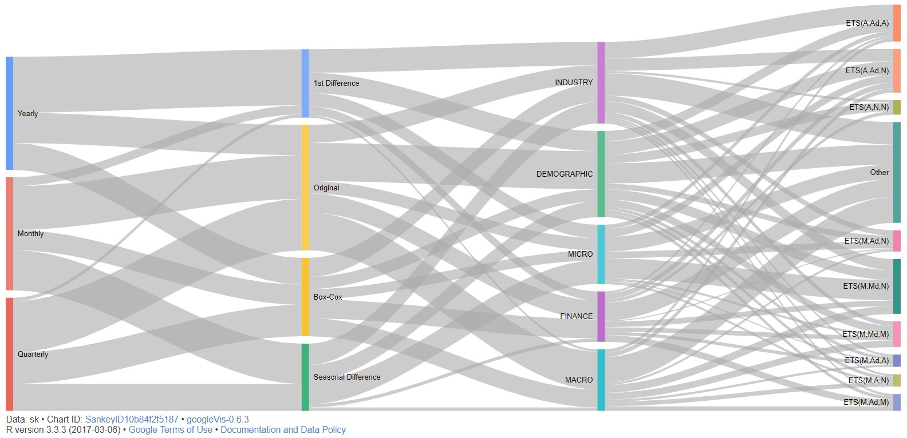

```{r global_options, include=FALSE}
library(knitr)
library(readr)
library(dplyr)
opts_chunk$set(warning=FALSE, message=FALSE, echo=FALSE)
```


# Introduction
The International Institute of Forecasters runs M - Competitions [@M3] to analyse multiple time series and produce accurate forecasts. The original data has 3003 time series of monthly, quarterly and yearly data which are further categorised into demographic, finance, industry, macroeconomic and microeconomic. A subset of the M3 data with 303 time series was examined in this report and forecasts from exponential smoothing and state space models were produced [@HyndmanRobJ2008FwES]. 

# Methods
The task was to fit the best model in terms of MASE to 95% of each series from the monthly, quarterly and yearly data respectively while minimizing the number of non-normal and correlated standardized residuals. For each time series, approximately 1200 models were fitted to the original, Box-Cox transformed, differenced, and seasonally differenced series by trying all allowable model combinations and changing the optimisation criteria for parameter selection. For all fitted models, the MASE value, the Shapiro-Wilks Box test p value, and the LJung-Box test p value were recorded. The candidate models were then separated into 3 groups: 

1. Models with both Shapiro and LJung p values greater than 0.05

2. Models with only Shapiro p value greater than 0.05

3. Models with only LJung Box test p value greater than 0.05

After this separation, the final model to be fitted was selected in the following way: 

* If the first list of models is non-empty, the model with the lowest MASE value from the list is selected

* If the first list is empty and one or both of the remaining lists are non-empty, the model with the lowest MASE value from one of the non-empty lists is selected

* If all lists are empty, simply select the model with the overall lowest MASE value from all 1200 candidate models

This model selection algorithm thus ensures the minimum number of non-normal and correlated standardized residuals for each model while at the same time minimizing its MASE value. The algorithm was applied to all time series, forecasts were produced with the selected model and transformed back to their original scale if necessary. Forecast MASE was then calculated using the remaining 5% of the series and the model's fitted values.


## Analysis

### Flow Chart



The Sankey diagram above shows the flow of the model selection process. Models fitted to the original series have generally performed better. First difference is rarely used for monthly and quarterly series, instead Box-Cox and seasonal difference is preferred. However, a significant number of yearly models have been fitted using the first differenced series. The state space model with multiplicative errors, multiplicative damped trend and no seasonality is the most fitted, especially with micro economic data.

\pagebreak

### Fitted Models

Figure \ref{fig:fitted-model} shows the list of all exponential and state space models fitted to all time series. The model with multiplicative errors, multiplicative damped trend and no seasonality is the most fitted, followed by the model with additive errors, additive damped trend and no seasonality. The Holt and Holt-Winters models are generally the least common with each model being fitted less than 5 times (apart from the Damped Holt-Winters Multiplicative Exponential model). It is observed that the top 5 models were fitted to more than half of the time series. 

```{r, fig.height=6, fig.width=7, fig.cap=paste("\\label{fig:fitted-model}Frequency of fitted models")}
#Load Libraries
require(tidyverse)
require(cowplot)

# Read files
overall.info.2 = read_csv('Overall_info.csv')

overall.info.2$`Season Frequency` <- overall.info.2$`Season Frequency` %>% 
  factor(levels = c(1,4,12), labels = c("Yearly","Quarterly","Monthly"))

# Data Wrangling 
models.info = overall.info.2 %>% 
  select(`Model Fitted`) %>% 
  group_by(`Model Fitted`) %>% 
  summarise(Freq = n())

# Rename long value
models.info$`Model Fitted`[models.info$`Model Fitted` == 
                             "Damped Holt-Winters' multiplicative method with exponential trend"] <- 
  "Damped Holt-Winters' multiplicative method (E)"

# factoring to sort
models.info$`Model Fitted` = models.info$`Model Fitted` %>% 
  factor(levels = models.info$`Model Fitted`[order(models.info$Freq)])

# visualize bar chart
ggplot(models.info,aes(x=`Model Fitted`,y=`Freq`)) + 
  geom_bar(stat='identity', fill='#008dd3') + 
  coord_flip() + 
  ggtitle('Frequency of fitted models in Sample M3 data') +
  xlab('') +
  ylab('Frequency of Models') +
  labs(subtitle = 'Data from 303 times series',
       caption="Source - International Institute of Forecasters") +
  theme_minimal() +
  theme(plot.caption = element_text(size = 8, color = '#666666', face = "italic"),
        plot.subtitle = element_text(size = 9, color = '#333333', face = "italic")) 
```

\newpage

### Top 5 Fitted Models by series Type

Figure \ref{fig:fitted-season} illustrates the top 5 fitted models by seasonalty. For the quarterly series, the state-space model with multiplicative errors, multiplicative damped trend and multiplicative seasonality has been fitted the most followed by the model with additive errors, additive damped trend and no seasonality.

For the monthly series, the model with additive errors, additive damped trend and additive seasonality is the most fitted followed by the model with additive errors, additive damped trend and no seasonality.

\vspace{12pt}

```{r, fig.height=5, fig.width=7, fig.cap=paste("\\label{fig:fitted-season}Top fitted models by Seasonality")}

# Data Wrangling 
models.seasonal = overall.info.2 %>% 
  select(`Model Fitted`,`Season Frequency`) %>% 
  group_by(`Model Fitted`,`Season Frequency`) %>% 
  summarise(Freq = n()) 

models.seasonal.M = models.seasonal %>% 
  filter(`Season Frequency` == 'Monthly') %>% 
  arrange(desc(Freq)) %>% head(5)

models.seasonal.Q = models.seasonal %>% 
  filter(`Season Frequency` == 'Quarterly') %>% 
  arrange(desc(Freq)) %>% head(5)

models.seasonal.Y = models.seasonal %>% 
  filter(`Season Frequency` == 'Yearly') %>% 
  arrange(desc(Freq)) %>% head(5)

models.seasonal = rbind(models.seasonal.M,models.seasonal.Q,models.seasonal.Y)

# visualize bar chart
ggplot(models.seasonal,aes(x=`Season Frequency`,y=`Freq`, fill=`Model Fitted`)) + 
  geom_bar(stat='identity', position = 'dodge', color = '#999999') + 
  scale_fill_brewer(palette = "Set3") +
  ggtitle('Top 5 fitted models according to Series Frequency') +
  xlab('') +
  ylab('Frequency of Models') +
  labs(subtitle = '(M,Md,N) Model for Yearly, (A,Ad,A) and (M,Md,M) in Quarterly, (A,Ad,A) for Monthly are highest',
       caption="Source - International Institute of Forecasters") +
  theme_minimal() +
  theme(plot.caption = element_text(size = 8, color = '#666666', face = "italic"),
        plot.subtitle = element_text(size = 9, color = '#333333', face = "italic")) 
```

\newpage

### Distribution of MASE

Figure \ref{fig:MASE-hist} shows the distribution of MASE values in the monthly, quarterly and yearly series. In the monthly series, the distribution is bi-modal with most values falling between 0.05 and 0.25 and also between 0.5 and 0.65. Several outliers with high MASE values have shifted the mean value to the right. On the other hand, the distribution for the quarterly series is closer to that of a normal distribution with a right tail. This tail is once again pulling the mean MASE value towards higher values. Finally, the MASE values for the yearly series have a negatively skewed distribution with the mean value being displaced towards lower values.

\vspace{12pt}

```{r ,fig.height=6, fig.width=7, fig.cap=paste("\\label{fig:MASE-hist}Models MASE distribution by Seasonality")}

# histograms for MASE distribution for 
overall.info.monthly <- overall.info.2[overall.info.2$`Season Frequency` == 'Monthly',]
overall.info.quarterly <- overall.info.2[overall.info.2$`Season Frequency` == 'Quarterly',]
overall.info.yearly <- overall.info.2[overall.info.2$`Season Frequency` == 'Yearly',]

h1 <- ggplot(data = overall.info.monthly, aes(x = `Model MASE`)) + 
  geom_density(alpha = 1/2, fill = "mediumseagreen") +
  geom_histogram(colour = "white", bins = 30, aes(`Model MASE`,..density..), alpha = 1/2, fill = "darkslateblue") +
  geom_vline(xintercept = mean(overall.info.monthly$`Model MASE`), colour = "red", linetype = 2) + 
  annotate("text", label = "Mean", x = mean(overall.info.monthly$`Model MASE`) + 0.02, y = 3)+ 
  geom_vline(xintercept = median(overall.info.monthly$`Model MASE`), colour = "red") + 
  annotate("text", label = "Median", x = median(overall.info.monthly$`Model MASE`) - 0.02, y = 3) +
  labs(y = "Density", x = "Monthly MASE",
       title = 'Models MASE distribution by Seasonality',
       subtitle = 'Distribution for Monthly data follows bimodal. Yearly series has highest MASE') +
  scale_x_continuous(limits = c(0,1.2)) +
  theme_minimal() +
  theme(plot.subtitle = element_text(color = '#333333',face = "italic")) 

h2 <- ggplot(data = overall.info.quarterly, aes(x = `Model MASE`)) + 
  geom_density(alpha = 1/2, fill = "mediumseagreen") +
  geom_histogram(colour = "white", bins = 30, aes(`Model MASE`,..density..), alpha = 1/2, fill = "darkslateblue") +
  geom_vline(xintercept = mean(overall.info.quarterly$`Model MASE`), colour = "red", linetype = 2) + 
  annotate("text", label = "Mean", x = mean(overall.info.quarterly$`Model MASE`) + 0.02, y = 3)+ 
  geom_vline(xintercept = median(overall.info.quarterly$`Model MASE`), colour = "red") + 
  annotate("text", label = "Median", x = median(overall.info.quarterly$`Model MASE`) - 0.02, y = 3.3) +
  labs(y = "Density", x = "Quarterly  MASE") +
  scale_x_continuous(limits = c(0,1.2)) +
  theme_minimal()

h3 <- ggplot(data = overall.info.yearly, aes(x = `Model MASE`)) + 
  geom_density(alpha = 1/2, fill = "mediumseagreen") +
  geom_histogram(colour = "white", bins = 30, aes(`Model MASE`,..density..), alpha = 1/2, fill = "darkslateblue") +
  geom_vline(xintercept = mean(overall.info.yearly$`Model MASE`), colour = "red", linetype = 2) + 
  annotate("text", label = "Mean", x = mean(overall.info.yearly$`Model MASE`) - 0.02, y = 3)+ 
  geom_vline(xintercept = median(overall.info.yearly$`Model MASE`), colour = "red") + 
  annotate("text", label = "Median", x = median(overall.info.yearly$`Model MASE`) + 0.02, y = 4.2) +
  labs(y = "Density", x = "Yearly MASE",
       caption="Source - International Institute of Forecasters") +
  scale_x_continuous(limits = c(0,1.2)) +
  theme_minimal() +
  theme(plot.caption = element_text(size = 9,color = '#666666',face = "italic")) 

# Combine All plots
cow <- plot_grid(h1, h2,h3, 
                 nrow = 3, ncol = 1,
                 vjust = 1, hjust = -1.8, label_fontface = "bold.italic")
cow
```

\newpage

Figure \ref{fig:MASE-box} shows the MASE value distribution in the different data categories. The monthly series have the lowest MASE in almost all categories, while the yearly series have highest MASE in every category. This may be an effect of the generally small number of observations available in each yearly time series. The best overall model perfomance in terms of MASE is seen in macroeconomic data with the majority of MASE values from all time series being less than 0.5.

\vspace{12pt}

```{r ,fig.cap=paste("\\label{fig:MASE-box}Model MASE by Series Category & Seasonality")}
ggplot(data = overall.info.2, aes(y = `Model MASE`)) + 
  geom_boxplot(aes(x = `Series Category`, fill = `Season Frequency`)) + 
  scale_fill_brewer(palette = 'Pastel1') +
  labs(fill = "Seasonality", title = "Model MASE by Series Category & Seasonality") +
  theme_minimal() +
  labs(subtitle = paste('Monthly series have the lowest MASE in most categories',
                        '\nHowever, yearly series MASE is always high'),
       caption="Source - International Institute of Forecasters") +
  theme_minimal() +
  theme(plot.caption = element_text(size = 8, color = '#666666', face = "italic"),
        plot.subtitle = element_text(size = 9, color = '#333333', face = "italic")) 
```

\newpage

### Results

The scatter plot in Figure \ref{fig:model.accuracy} displays 1 step ahead forecasts with actual observed values by seasonality. Ideally, the forecasts would fall on the x=y line (e.g forecasts are equal to observed value). According to the graph, this is true for all series with data points converging to the x=y line. However, as expected, forecasts for the yearly series perform slightly worse than for the quarterly and monthly series.

\vspace{12pt}

```{r ,fig.height=6, fig.width=7, fig.cap=paste("\\label{fig:model.accuracy}Forecasting Accuracy Comparision")}
# Read data
lm.data = read.csv('frc.1step.csv')

ggplot(lm.data, aes(x = Observed, y = Forecast)) + 
  stat_smooth(method = "lm", aes(colour = Seasonality), se=F) +
  geom_point(alpha=.6) +
  facet_grid(Seasonality~.) + 
  guides(colour = FALSE) +
  ggtitle('1 Step Ahead Forecasts and Actual Observed Series Values by Seasonality') +
  xlab('Observed Data Points') +
  ylab('Forecast Data Points') +
  labs(subtitle = 'Forecasts are fitted well for the series',
       caption="Source - International Institute of Forecasters") +
  theme_grey() +
  theme(plot.caption = element_text(size = 8, color = '#666666', face = "italic"),
        plot.subtitle = element_text(size = 9, color = '#333333', face = "italic"))  
```

\newpage

```{r}
# Summary Table
model.summary = overall.info.2 %>% 
  group_by(`Season Frequency`) %>% 
  summarise('Mean Model MASE' = mean(`Model MASE`), 
            'Mean Forecast MASE'=mean(`Forecast MASE`),
            'Mean Shapiro'=mean(`Shapiro-Wilks`),
            'Mean Ljung'=mean(`Ljung-Box`),
            'Non-Normal Std Residuals' = sum(`Non-Normal Std Residuals`),
            'Correlated Std Residuals' = sum(`Correlated Std Residuals`),
            'Mean AIC' = mean(AIC),
            'Mean AICc' = mean(AICc),
            'Mean BIC' = mean(BIC)) %>%
  arrange(`Mean Model MASE`)
kable(model.summary[,1:5], caption="\\label{tab:summary1}Time Series Model Mean Summary")
kable(model.summary[,c(1,6:7)] , caption="\\label{tab:summary2}Time Series Model Residual Count")
kable(model.summary[,c(1,8:10)] , caption="\\label{tab:summary3}Time Series Model Information Criteria")

```

By examining Table \ref{tab:summary1} and \ref{tab:summary2}, it can be inferred that models for the monthly series have the smallest MASE value of 0.343, mean forecast MASE of 1.557, mean Shapiro of 0.25, mean Ljung of 0.594, 14 non-normal standardized residuals, and 5 correlated standardized residuals. So, even though they have the smallest mean MASE value, models for the monthly series have the largest number of models with non-normal and correlated standardized residuals. 

Similar results are observed for the models of the quaterly series with a mean MASE value of 0.379, mean forecast MASE of 1.22, mean Shapiro of 0.318, mean Ljung of 0.638, 2 non-normal standardized residuals, and 1 model with correlated standardized residuals. This means that the quarterly series models have the lowest mean forecast MASE value and also the smallest number of models with non-normal and correlated standardized residuals.

The yearly series on the other hand has the  MASE value of 0.634, mean forecast MASE of 1.73, mean Shapiro of 0.376, mean Ljung of 0.566, 3 models with non-normal standardized residuals, and 1 model with correlated standardized residuals. These results fall in line with our previous observations regarding the yearly series. 

Interestingly, in terms of model information criteria (\ref{tab:summary3}), the models for the monthly series have the highest mean AIC, AICc, and BIC values followed by the quarterly series and finally the yearly series with the lowest values.


## Conclusion

Exponential smoothing and state space models were used to forecast 303 M3 time series, which has produced interesting results. Models for the monthly series had the best performance in terms of MASE values, models for the quarterly series appeared to have the best performance in terms of forecast accuracy (lowest forecast MASE value), and finally the models for the yearly time series had the lowest values of AIC, AICc, and BIC. 


# Appendix

## Main Script

```{r, eval=FALSE, echo=TRUE}

# Import Libraries and functions
library(forecast)
source('Functions.R')

# read data
monthly <- read_csv("~/Monthly.csv")
quarterly <- read_csv("~/Quarterly.csv")
yearly <- read_csv("~/Yearly.csv")  

#  objects to store results (monthly)
models.monthly <- list()
model.info.monthly <- list()
forecasts.monthly <- list()
series95.monthly <- list()
series05.monthly <- list()
fitted.monthly <- list()

# array to store overall model fitting info
overall.info <- array(NA,
                      dim = c(303,11), 
                      dimnames = list(NULL,c("Series Category","Season Frequency",
                                             "Model Fitted","Series Used",
                                             "Model MASE","Forecast MASE","Shapiro-Wilks", 
                                             "Ljung-Box", "AIC", "AICc", "BIC")))
count <- 1

# monthly loop
freq <- 12
for(i in 1:nrow(monthly)){
  
  # converting to ts objects leaving at least 2 observations in the 5% series
  if((0.05*monthly$N[i]<3) && (monthly[i,monthly$N[i]+5] == monthly[i,monthly$N[i]+6])){
    series95.monthly[[i]] <- ts(as.vector(t(as.matrix(monthly[i,7:(monthly$N[i]+3)]))),
                                start = c(monthly$Starting.Year[i], monthly$Starting.Month[i]),
                                frequency = freq)
    series05.monthly[[i]] <- ts(as.vector(t(as.matrix(monthly[i,(monthly$N[i]+4):(monthly$N[i]+6)]))),
                                start=end(series95.monthly[[i]])+c(0,1), 
                                frequency = freq)
  }else if(0.05*monthly$N[i]<3){
    series95.monthly[[i]] <- ts(as.vector(t(as.matrix(monthly[i,7:(monthly$N[i]+4)]))),
                                start = c(monthly$Starting.Year[i], monthly$Starting.Month[i]),
                                frequency = freq)
    series05.monthly[[i]] <- ts(as.vector(t(as.matrix(monthly[i,(monthly$N[i]+5):(monthly$N[i]+6)]))),
                                start=end(series95.monthly[[i]])+c(0,1), 
                                frequency = freq)
  }else{
    series95.monthly[[i]] <- ts(as.vector(t(as.matrix(monthly[i,7:(round(0.95*monthly$N[i])+6)]))),
                                start=c(monthly$Starting.Year[i],monthly$Starting.Month[i]), 
                                frequency = freq)
    
    series05.monthly[[i]] <- ts(as.vector(t(
      as.matrix(monthly[i,(round(0.95*monthly$N[i])+7):(monthly$N[i]+6)]))),
                                start=end(series95.monthly[[i]])+c(0,1), 
                                frequency = freq)
  }
  
  # model fitting
  fit <- expSmooth(series95.monthly[[i]])
  models.monthly[[i]] <- fit[[1]]
  model.info.monthly[[i]] <- fit[[2]]
  fitted.monthly[[i]] <- models.monthly[[i]]$fitted
  overall.info[count,"Model MASE"] <- model.info.monthly[[i]][,"MASE"]
  overall.info[count,"Shapiro-Wilks"] <- model.info.monthly[[i]][,"Shapiro-Wilks"]
  overall.info[count,"Ljung-Box"] <- model.info.monthly[[i]][,"Ljung-Box"]
  
  # forecasts
  forecasts.monthly[[i]] <- forecast(models.monthly[[i]], h = length(series05.monthly[[i]]))$mean
  
  # reversing transformations
  if(model.info.monthly[[i]][,"Series Used"] == "Original"){
    fitted.monthly[[i]] <- fitted.monthly[[i]] - model.info.monthly[[i]][,"Added Value"]
    forecasts.monthly[[i]] <- forecasts.monthly[[i]] - model.info.monthly[[i]][,"Added Value"]
  }
  if(model.info.monthly[[i]][,"Series Used"] == "Box-Cox"){
    fitted.monthly[[i]] <- invBoxCox(
      fitted.monthly[[i]], model.info.monthly[[i]][,"Lambda"]) - 
      model.info.monthly[[i]][,"Added Value"]
    forecasts.monthly[[i]] <- invBoxCox(
      forecasts.monthly[[i]], model.info.monthly[[i]][,"Lambda"]) - 
      model.info.monthly[[i]][,"Added Value"]
  }
  if(model.info.monthly[[i]][,"Series Used"] == "1st Difference"){
    fitted.monthly[[i]] <- diffinv(fitted.monthly[[i]], xi = series95.monthly[[i]][1], lag = 1)
    
    comb <- ts.union(diff(series95.monthly[[i]]) , 
                     forecasts.monthly[[i]] - model.info.monthly[[i]][,"Added Value"])
    ts.combined.diff  = pmin(comb[,1], comb[,2], na.rm = TRUE)
    back.series = diffinv(ts.combined.diff, xi = series95.monthly[[i]][1],lag = 1)
    forecasts.monthly[[i]] = window(back.series,start = start(series05.monthly[[i]]))
  }
  if(model.info.monthly[[i]][,"Series Used"] == "Seasonal Difference"){
    fitted.monthly[[i]] <- diffinv(fitted.monthly[[i]], xi = series95.monthly[[i]][1:freq],lag = freq)
    
    comb <- ts.union(diff(series95.monthly[[i]], lag = freq) , forecasts.monthly[[i]] - 
                       model.info.monthly[[i]][,"Added Value"])
    ts.combined.diff  = pmin(comb[,1], comb[,2], na.rm = TRUE)
    back.series = diffinv(ts.combined.diff, xi = series95.monthly[[i]][1:freq],lag = freq)
    forecasts.monthly[[i]] = window(back.series,start = start(series05.monthly[[i]]))
  }
  
  overall.info[count,"Forecast MASE"] <- as.numeric(MASE.custom(as.vector(fitted.monthly[[i]]),
                                                                as.vector(series05.monthly[[i]]), 
                                                                as.vector(forecasts.monthly[[i]])))
  
  # storing overall info 
  overall.info[count,"Series Category"] <- as.character(monthly[i,"Category"])
  overall.info[count,"Season Frequency"] <- freq
  overall.info[count,"Model Fitted"] <- models.monthly[[i]]$method
  overall.info[count,"Series Used"] <- as.character(model.info.monthly[[i]][,"Series Used"])
  overall.info[count,"AIC"] <- if(grepl("ETS",models.monthly[[i]]$method)){
    models.monthly[[i]]$aic}else{
      models.monthly[[i]]$model$aic}
  overall.info[count,"AICc"] <- if(grepl("ETS",models.monthly[[i]]$method)){
    models.monthly[[i]]$aicc}else{
      models.monthly[[i]]$model$aicc}
  overall.info[count,"BIC"] <- if(grepl("ETS",models.monthly[[i]]$method)){
    models.monthly[[i]]$bic}else{
      models.monthly[[i]]$model$bic}
  
  count <- count + 1
}


#  objects to store results (quarterly)
models.quarterly <- list()
model.info.quarterly <- list()
forecasts.quarterly <- list()
series95.quarterly <- list()
series05.quarterly <- list()
fitted.quarterly <- list()

# quarterly loop
freq <- 4
for(i in 1:nrow(quarterly)){
  if((0.05*quarterly$N[i]<3) && (quarterly[i,quarterly$N[i]+5] == quarterly[i,quarterly$N[i]+6])){
    series95.quarterly[[i]] <- ts(as.vector(t(
      as.matrix(quarterly[i,7:(quarterly$N[i]+3)]))),
                                  start = c(quarterly$Starting.Year[i], quarterly$Starting.Month[i]),
                                  frequency = freq)
    series05.quarterly[[i]] <- ts(as.vector(t(
      as.matrix(quarterly[i,(quarterly$N[i]+4):(quarterly$N[i]+6)]))),
                                  start=end(series95.quarterly[[i]])+c(0,1), 
                                  frequency = freq)
  }else if(0.05*quarterly$N[i]<3){
    series95.quarterly[[i]] <- ts(as.vector(t(
      as.matrix(quarterly[i,7:(quarterly$N[i]+4)]))),
                                  start = c(quarterly$Starting.Year[i], quarterly$Starting.Quarter[i]),
                                  frequency = freq)
    series05.quarterly[[i]] <- ts(as.vector(t(
      as.matrix(quarterly[i,(quarterly$N[i]+5):(quarterly$N[i]+6)]))),
                                  start=end(series95.quarterly[[i]])+c(0,1), 
                                  frequency = freq)
  }else{
    series95.quarterly[[i]] <- ts(as.vector(t(
      as.matrix(quarterly[i,7:(round(0.95*quarterly$N[i])+6)]))),
                                  start=c(quarterly$Starting.Year[i],quarterly$Starting.Quarter[i]), 
                                  frequency = freq)
    
    series05.quarterly[[i]] <- ts(as.vector(t(as.matrix(quarterly[i,(round(0.95*quarterly$N[i])+7):(quarterly$N[i]+6)]))),
                                  start=end(series95.quarterly[[i]])+c(0,1), 
                                  frequency = freq)
  }
  
  # model fitting
  fit <- expSmooth(series95.quarterly[[i]])
  models.quarterly[[i]] <- fit[[1]]
  model.info.quarterly[[i]] <- fit[[2]]
  fitted.quarterly[[i]] <- models.quarterly[[i]]$fitted
  overall.info[count,"Model MASE"] <- model.info.quarterly[[i]][,"MASE"]
  overall.info[count,"Shapiro-Wilks"] <- model.info.quarterly[[i]][,"Shapiro-Wilks"]
  overall.info[count,"Ljung-Box"] <- model.info.quarterly[[i]][,"Ljung-Box"]
  
  # forecasts
  forecasts.quarterly[[i]] <- forecast(models.quarterly[[i]], 
                                       h = length(series05.quarterly[[i]]))$mean
  
  # reversing transformations
  if(model.info.quarterly[[i]][,"Series Used"] == "Original"){
    fitted.quarterly[[i]] <- fitted.quarterly[[i]] - 
      model.info.quarterly[[i]][,"Added Value"]
    forecasts.quarterly[[i]] <- forecasts.quarterly[[i]] - 
      model.info.quarterly[[i]][,"Added Value"]
  }
  if(model.info.quarterly[[i]][,"Series Used"] == "Box-Cox"){
    fitted.quarterly[[i]] <- invBoxCox(fitted.quarterly[[i]], 
                                       model.info.quarterly[[i]][,"Lambda"]) - 
      model.info.quarterly[[i]][,"Added Value"]
    forecasts.quarterly[[i]] <- invBoxCox(forecasts.quarterly[[i]], 
                                          model.info.quarterly[[i]][,"Lambda"]) - 
      model.info.quarterly[[i]][,"Added Value"]
  }
  if(model.info.quarterly[[i]][,"Series Used"] == "1st Difference"){
    fitted.quarterly[[i]] <- diffinv(fitted.quarterly[[i]], xi = series95.quarterly[[i]][1], lag = 1)
    
    comb <- ts.union(diff(series95.quarterly[[i]]) , 
                     forecasts.quarterly[[i]] - 
                       model.info.quarterly[[i]][,"Added Value"])
    ts.combined.diff  = pmin(comb[,1], comb[,2], na.rm = TRUE)
    back.series = diffinv(ts.combined.diff, 
                          xi = series95.quarterly[[i]][1],
                          lag = 1)
    forecasts.quarterly[[i]] = window(back.series,
                                      start = start(series05.quarterly[[i]]))
  }
  if(model.info.quarterly[[i]][,"Series Used"] == "Seasonal Difference"){
    fitted.quarterly[[i]] <- diffinv(fitted.quarterly[[i]], 
                                     xi = series95.quarterly[[i]][1:freq],lag = freq)
    
    comb <- ts.union(diff(series95.quarterly[[i]], lag = freq) , 
                     forecasts.quarterly[[i]] - model.info.quarterly[[i]][,"Added Value"])
    ts.combined.diff  = pmin(comb[,1], comb[,2], na.rm = TRUE)
    back.series = diffinv(ts.combined.diff, xi = series95.quarterly[[i]][1:freq],lag = freq)
    forecasts.quarterly[[i]] = window(back.series,start = start(series05.quarterly[[i]]))
  }
  
  overall.info[count,"Forecast MASE"] <- as.numeric(
    MASE.custom(as.vector(fitted.quarterly[[i]]),
                as.vector(series05.quarterly[[i]]), 
                as.vector(forecasts.quarterly[[i]])))
  
  # storing overall info 
  overall.info[count,"Series Category"] <- as.character(quarterly[i,"Category"])
  overall.info[count,"Season Frequency"] <- freq
  overall.info[count,"Model Fitted"] <- models.quarterly[[i]]$method
  overall.info[count,"Series Used"] <- as.character(model.info.quarterly[[i]][,"Series Used"])
  overall.info[count,"AIC"] <- if(grepl("ETS",models.quarterly[[i]]$method)){
    models.quarterly[[i]]$aic}else{
      models.quarterly[[i]]$model$aic}
  overall.info[count,"AICc"] <- if(grepl("ETS",models.quarterly[[i]]$method)){
    models.quarterly[[i]]$aicc}else{
      models.quarterly[[i]]$model$aicc}
  overall.info[count,"BIC"] <- if(grepl("ETS",models.quarterly[[i]]$method)){
    models.quarterly[[i]]$bic}else{
      models.quarterly[[i]]$model$bic}
  
  count <- count + 1
}


#  objects to store results (yearly)
models.yearly <- list()
model.info.yearly <- list()
forecasts.yearly <- list()
series95.yearly <- list()
series05.yearly <- list()
fitted.yearly <- list()

# yearly loop
freq = 1
for(i in 1:nrow(yearly)){
  if((0.05*yearly$N[i]<3) && (yearly[i,yearly$N[i]+5] == yearly[i,yearly$N[i]+6])){
    series95.yearly[[i]] <- ts(as.vector(t(as.matrix(yearly[i,7:(yearly$N[i]+3)]))),
                               start = c(yearly$Starting.Year[i], yearly$Starting.Month[i]),
                               frequency = freq)
    series05.yearly[[i]] <- ts(as.vector(t(as.matrix(yearly[i,(yearly$N[i]+4):(yearly$N[i]+6)]))),
                               start=end(series95.yearly[[i]])+c(0,1), 
                               frequency = freq)
  }else if(0.05*yearly$N[i]<3){
    series95.yearly[[i]] <- ts(as.vector(t(as.matrix(yearly[i,7:(yearly$N[i]+4)]))),
                               start = yearly$Starting.Year[i])
    series05.yearly[[i]] <- ts(as.vector(t(as.matrix(yearly[i,(yearly$N[i]+5):(yearly$N[i]+6)]))),
                               start=end(series95.yearly[[i]])+c(1,0))
  }else{
    series95.yearly[[i]] <- ts(as.vector(t(
      as.matrix(yearly[i,7:(round(0.95*yearly$N[i])+6)]))),
                               start=yearly$Starting.Year[i])
    
    series05.yearly[[i]] <- ts(as.vector(t(
      as.matrix(yearly[i,(round(0.95*yearly$N[i])+7):(yearly$N[i]+6)]))),
                               start=end(series95.yearly[[i]])+c(1,0))
  }
  
  # model fitting
  fit <- expSmooth(series95.yearly[[i]])
  models.yearly[[i]] <- fit[[1]]
  model.info.yearly[[i]] <- fit[[2]]
  fitted.yearly[[i]] <- models.yearly[[i]]$fitted
  overall.info[count,"Model MASE"] <- model.info.yearly[[i]][,"MASE"]
  overall.info[count,"Shapiro-Wilks"] <- model.info.yearly[[i]][,"Shapiro-Wilks"]
  overall.info[count,"Ljung-Box"] <- model.info.yearly[[i]][,"Ljung-Box"]
  
  # forecasts
  forecasts.yearly[[i]] <- tryCatch(forecast(models.yearly[[i]], 
                                             h = length(series05.yearly[[i]]))$mean,
                                    error = function(cond){
                                      return(forecast(ets(series95.yearly[[i]], "ZZZ"), 
                                                      h = length(series05.yearly[[i]]))$mean)
                                    })
  
  # reversing transformations
  if(model.info.yearly[[i]][,"Series Used"] == "Original"){
    fitted.yearly[[i]] <- fitted.yearly[[i]] - model.info.yearly[[i]][,"Added Value"]
    forecasts.yearly[[i]] <- forecasts.yearly[[i]] - 
      model.info.yearly[[i]][,"Added Value"]
  }
  if(model.info.yearly[[i]][,"Series Used"] == "Box-Cox"){
    fitted.yearly[[i]] <- invBoxCox(fitted.yearly[[i]], 
                                    model.info.yearly[[i]][,"Lambda"]) - 
      model.info.yearly[[i]][,"Added Value"]
    forecasts.yearly[[i]] <- invBoxCox(forecasts.yearly[[i]], 
                                       model.info.yearly[[i]][,"Lambda"]) - 
      model.info.yearly[[i]][,"Added Value"]
  }
  if(model.info.yearly[[i]][,"Series Used"] == "1st Difference"){
    fitted.yearly[[i]] <- diffinv(fitted.yearly[[i]], xi = series95.yearly[[i]][1], lag = 1)
    
    comb <- ts.union(diff(series95.yearly[[i]]) , 
                     forecasts.yearly[[i]] - model.info.yearly[[i]][,"Added Value"])
    ts.combined.diff  = pmin(comb[,1], comb[,2], na.rm = TRUE)
    back.series = diffinv(ts.combined.diff, xi = series95.yearly[[i]][1],lag = 1)
    forecasts.yearly[[i]] = window(back.series,start = start(series05.yearly[[i]]))
  }
  if(model.info.yearly[[i]][,"Series Used"] == "Seasonal Difference"){
    fitted.yearly[[i]] <- diffinv(fitted.yearly[[i]], xi = series95.yearly[[i]][1:freq],lag = freq)
    
    comb <- ts.union(diff(series95.yearly[[i]], lag = freq) , 
                     forecasts.yearly[[i]] - model.info.yearly[[i]][,"Added Value"])
    ts.combined.diff  = pmin(comb[,1], comb[,2], na.rm = TRUE)
    back.series = diffinv(ts.combined.diff, xi = series95.yearly[[i]][1:freq],lag = freq)
    forecasts.yearly[[i]] = window(back.series,start = start(series05.yearly[[i]]))
  }
  
  overall.info[count,"Forecast MASE"] <- as.numeric(MASE.custom(as.vector(fitted.yearly[[i]]),
                                                                as.vector(series05.yearly[[i]]), 
                                                                as.vector(forecasts.yearly[[i]])))
  
  # storing overall info 
  overall.info[count,"Series Category"] <- as.character(yearly[i,"Category"])
  overall.info[count,"Season Frequency"] <- freq
  overall.info[count,"Model Fitted"] <- models.yearly[[i]]$method
  overall.info[count,"Series Used"] <- as.character(model.info.yearly[[i]][,"Series Used"])
  overall.info[count,"AIC"] <- if(grepl("ETS",models.yearly[[i]]$method)){
    models.yearly[[i]]$aic}else{
      models.yearly[[i]]$model$aic}
  overall.info[count,"AICc"] <- if(grepl("ETS",models.yearly[[i]]$method)){
    models.yearly[[i]]$aicc}else{
      models.yearly[[i]]$model$aicc}
  overall.info[count,"BIC"] <- if(grepl("ETS",models.yearly[[i]]$method)){
    models.yearly[[i]]$bic}else{
      models.yearly[[i]]$model$bic}
  
  count <- count + 1
}

# Results
overall.info <- as.data.frame(overall.info)
overall.info[, c(2,5:11)] <- sapply(overall.info[, c(2,5:11)], as.character)
overall.info[, c(2,5:11)] <- sapply(overall.info[, c(2,5:11)], as.numeric)
colnames(overall.info) <- c("Series Category","Season Frequency","Model Fitted",
                            "Series Used","Model MASE",
                            "Forecast MASE","Shapiro-Wilks",
                            "Ljung-Box","AIC","AICc","BIC")

# counting non-normal and correlated residuals
overall.info$`Non-Normal Std Residuals` <- ifelse(overall.info$`Shapiro-Wilks` < 0.05, 1, 0)
overall.info$`Correlated Std Residuals` <- ifelse(overall.info$`Ljung-Box` < 0.05, 1, 0)

# filtering by series season frequency
overall.info.monthly <- overall.info[overall.info[,"Season Frequency"] == 12,]
overall.info.quarterly <- overall.info[overall.info[,"Season Frequency"] == 4,]
overall.info.yearly <- overall.info[overall.info[,"Season Frequency"] == 1,]


results <- data.frame(matrix(NA, nrow = 3, ncol = 6), row.names = c("Monthly","Quarterly","Yearly"))
colnames(results) <- c("Mean Model MASE","Mean Forecast MASE","Mean Shapiro",
                       "Mean Ljung", "Non-Normal Std Residuals",
                       "Correlated Std Residuals")
results[1,1] <- mean(overall.info.monthly[,"Model MASE"])
results[2,1] <- mean(overall.info.quarterly[,"Model MASE"])
results[3,1] <- mean(overall.info.yearly[,"Model MASE"])
results[1,2] <- mean(overall.info.monthly[,"Forecast MASE"])
results[2,2] <- mean(overall.info.quarterly[,"Forecast MASE"])
results[3,2] <- mean(overall.info.yearly[,"Forecast MASE"])
results[1,3] <- mean(overall.info.monthly[,"Shapiro-Wilks"])
results[2,3] <- mean(overall.info.quarterly[,"Shapiro-Wilks"])
results[3,3] <- mean(overall.info.yearly[,"Shapiro-Wilks"])
results[1,4] <- mean(overall.info.monthly[,"Ljung-Box"])
results[2,4] <- mean(overall.info.quarterly[,"Ljung-Box"])
results[3,4] <- mean(overall.info.yearly[,"Ljung-Box"])
results[1,5] <- mean(sum(overall.info.monthly[,"Non-Normal Std Residuals"]))
results[2,5] <- mean(sum(overall.info.quarterly[,"Non-Normal Std Residuals"]))
results[3,5] <- mean(sum(overall.info.yearly[,"Non-Normal Std Residuals"]))
results[1,6] <- mean(sum(overall.info.monthly[,"Correlated Std Residuals"]))
results[2,6] <- mean(sum(overall.info.quarterly[,"Correlated Std Residuals"]))
results[3,6] <- mean(sum(overall.info.quarterly[,"Correlated Std Residuals"]))

```

\vspace{12pt}

## Functions.R Script

```{r, eval=FALSE, echo=TRUE}
library(forecast)


expSmooth <- function(ts) {
  # array to store models
  models <- list()
  model.info <- array(NA,
                      dim = c(1500,7), 
                      dimnames = list(NULL,c("ID","MASE","Shapiro-Wilks",
                                             "Ljung-Box","Series Used","Lambda","Added Value")))
  
  # model options
  exponential <- c(TRUE,FALSE)
  damped <- c(TRUE,FALSE)
  method <- c("ANN","ANA","MNN","MNA","MNM")
  methodDamp <- c("AAN","AAA","MAN","MMN","MAA","MAM","MMM")  
  opt.crit <- c("lik","amse","mse","sigma","mae")
  bounds <- c("both","usual","admissible")
  
  # time series lists
  ts.pos.list <- list()
  ts.neg.list <- list()
  ts.neg.list[[1]] <- ts
  
  
  # adjusting negative series & box-cox transformations
  min_value <- min(ts)
  add_value <- 0
  if(min_value <= 0){
    add_value <- abs(min_value) + 2
    ts_add <- ts + add_value
    lambda <- BoxCox.lambda(ts_add, method = "loglik")
    bc <- BoxCox(ts_add,lambda)
    ts.pos.list[[1]] <- ts_add
    ts.pos.list[[2]] <- bc
    ts.neg.list[[2]] <- bc
  }else{
    lambda <- BoxCox.lambda(ts, method = "loglik")
    bc <- BoxCox(ts,lambda)
    ts.pos.list[[1]] <- ts
    ts.pos.list[[2]] <- bc
    ts.neg.list[[2]] <- bc
  }
  
  # differencing
  ts.diff <- diff(ts)
  ts.neg.list[[3]] <- ts.diff
  
  ts.seas.diff <- diff(ts, lag = frequency(ts))
  ts.neg.list[[4]] <- ts.seas.diff
  
  add_value_seas_diff <- abs(min(ts.seas.diff)) + 2
  ts.seas.diff.add <- ts.seas.diff + add_value_seas_diff
  ts.pos.list[[4]] <- ts.seas.diff.add
  
  add_value_diff <- abs(min(ts.diff)) + 2
  ts.diff.add <- ts.diff + add_value_diff
  ts.pos.list[[3]] <- ts.diff.add
  
  # ts info
  added.value.neg <- c(0,add_value,0,0)
  added.value.pos <- c(add_value,add_value,add_value_diff,add_value_seas_diff)
  lambda.array <- c(0,lambda,0,0)
  ts.type <- c("Original","Box-Cox","1st Difference","Seasonal Difference")
  
  # array row counter
  count <- 1
  
  for(j in 1:length(ts.neg.list)){
    model <- try(holt(ts.neg.list[[j]], damped = TRUE, exponential = FALSE), 
                 silent = TRUE)
    models[[count]] <- model
    model.info[count,"ID"] <- count
    model.info[count,"MASE"] <- try(accuracy(model$model)[1,"MASE"], silent = TRUE)
    model.info[count,"Shapiro-Wilks"] <- try(shapiro.test(model$model$residuals)$p.value, 
                                             silent = TRUE)
    model.info[count,"Ljung-Box"] <- try(Box.test(model$model$residuals, 
                                                  lag = 1, 
                                                  type = "Ljung-Box", 
                                                  fitdf = 0)$p.value, silent = TRUE)
    model.info[count,"Series Used"] <- ts.type[j]
    model.info[count,"Lambda"] <- lambda.array[j]
    model.info[count,"Added Value"] <- added.value.neg[j]
    
    count <- count + 1
    
    model <- try(ses(ts.neg.list[[j]]), silent = TRUE)
    models[[count]] <- model
    model.info[count,"ID"] <- count
    model.info[count,"MASE"] <- try(accuracy(model$model)[1,"MASE"], silent = TRUE)
    model.info[count,"Shapiro-Wilks"] <- try(shapiro.test(model$model$residuals)$p.value, 
                                             silent = TRUE)
    model.info[count,"Ljung-Box"] <- try(Box.test(model$model$residuals, 
                                                  lag = 1, 
                                                  type = "Ljung-Box", 
                                                  fitdf = 0)$p.value, 
                                         silent = TRUE)
    model.info[count,"Series Used"] <- ts.type[j]
    model.info[count,"Lambda"] <- lambda.array[j]
    model.info[count,"Added Value"] <- added.value.neg[j]
    
    count <- count + 1
  }
  
  
  for(i in 1:2){
    for(j in 1:length(ts.pos.list)){
      if(exponential[i] == TRUE){
        model <- try(holt(ts.pos.list[[j]], damped = FALSE, 
                          exponential = exponential[i]), silent = TRUE)
        models[[count]] <- model
        model.info[count,"ID"] <- count
        model.info[count,"MASE"] <- try(accuracy(model$model)[1,"MASE"], silent = TRUE)
        model.info[count,"Shapiro-Wilks"] <- try(shapiro.test(model$model$residuals)$p.value, 
                                                 silent = TRUE)
        model.info[count,"Ljung-Box"] <- try(Box.test(model$model$residuals, 
                                                      lag = 1, 
                                                      type = "Ljung-Box", 
                                                      fitdf = 0)$p.value, 
                                             silent = TRUE)
        model.info[count,"Series Used"] <- ts.type[j]
        model.info[count,"Lambda"] <- lambda.array[j]
        model.info[count,"Added Value"] <- added.value.pos[j]
        
        count <- count + 1
      }else{
        model <- try(holt(ts.neg.list[[j]], damped = FALSE, exponential = exponential[i]), 
                     silent = TRUE)
        models[[count]] <- model
        model.info[count,"ID"] <- count
        model.info[count,"MASE"] <- try(accuracy(model$model)[1,"MASE"], 
                                        silent = TRUE)
        model.info[count,"Shapiro-Wilks"] <- try(shapiro.test(model$model$residuals)$p.value, 
                                                 silent = TRUE)
        model.info[count,"Ljung-Box"] <- try(Box.test(model$model$residuals, 
                                                      lag = 1, 
                                                      type = "Ljung-Box", 
                                                      fitdf = 0)$p.value, 
                                             silent = TRUE)
        model.info[count,"Series Used"] <- ts.type[j]
        model.info[count,"Lambda"] <- lambda.array[j]
        model.info[count,"Added Value"] <- added.value.neg[j]
        
        count <- count + 1
      }
      
      
      model <- try(hw(ts.neg.list[[j]], damped = damped[i], exponential = FALSE, 
                      seasonal = "additive"), silent = TRUE)
      models[[count]] <- model
      model.info[count,"ID"] <- count
      model.info[count,"MASE"] <- try(accuracy(model$model)[1,"MASE"], 
                                      silent = TRUE)
      model.info[count,"Shapiro-Wilks"] <- try(shapiro.test(model$model$residuals)$p.value, 
                                               silent = TRUE)
      model.info[count,"Ljung-Box"] <- try(Box.test(model$model$residuals, 
                                                    lag = 1, 
                                                    type = "Ljung-Box", 
                                                    fitdf = 0)$p.value, 
                                           silent = TRUE)
      model.info[count,"Series Used"] <- ts.type[j]
      model.info[count,"Lambda"] <- lambda.array[j]
      model.info[count,"Added Value"] <- added.value.neg[j]
      
      count <- count + 1
    }
  }
  
  
  # option grid
  expand.de <- expand.grid(damped, exponential, stringsAsFactors = FALSE)
  
  for(i in 1:nrow(expand.de)){
    for(j in 1:length(ts.pos.list)){
      
      model <- try(hw(ts.pos.list[[j]], damped = expand.de[i,1], exponential = expand.de[i,2], 
                      seasonal = "multiplicative"), silent = TRUE)
      models[[count]] <- model
      model.info[count,"ID"] <- count
      model.info[count,"MASE"] <- try(accuracy(model$model)[1,"MASE"], silent = TRUE)
      model.info[count,"Shapiro-Wilks"] <- try(shapiro.test(model$model$residuals)$p.value, 
                                               silent = TRUE)
      model.info[count,"Ljung-Box"] <- try(Box.test(model$model$residuals, 
                                                    lag = 1, 
                                                    type = "Ljung-Box", 
                                                    fitdf = 0)$p.value, 
                                           silent = TRUE)
      model.info[count,"Series Used"] <- ts.type[j]
      model.info[count,"Lambda"] <- lambda.array[j]
      model.info[count,"Added Value"] <- added.value.pos[j]
      
      count <- count + 1
    }
  }
  
  # options grid
  expand.mob <- expand.grid(method, opt.crit, bounds, stringsAsFactors = FALSE)
  
  for(i in 1:nrow(expand.mob)){
    for(j in 1:length(ts.pos.list)){
      if(grepl("M",expand.mob[i,1])){
        model <- try(ets(ts.pos.list[[j]],model = expand.mob[i,1], opt.crit = expand.mob[i,2],
                         bounds = expand.mob[i,3]), silent = TRUE)
        models[[count]] <- model
        model.info[count,"ID"] <- count
        model.info[count,"MASE"] <- try(accuracy(model)[1,"MASE"], silent = TRUE)
        model.info[count,"Shapiro-Wilks"] <- try(shapiro.test(model$residuals)$p.value,
                                                 silent = TRUE)
        model.info[count,"Ljung-Box"] <- try(Box.test(model$residuals, 
                                                      lag = 1, 
                                                      type = "Ljung-Box", 
                                                      fitdf = 0)$p.value, 
                                             silent = TRUE)
        model.info[count,"Series Used"] <- ts.type[j]
        model.info[count,"Lambda"] <- lambda.array[j]
        model.info[count,"Added Value"] <- added.value.pos[j]
        
        count <- count + 1
      }else{
        model <- try(ets(ts.neg.list[[j]],model = expand.mob[i,1], 
                         opt.crit = expand.mob[i,2],
                         bounds = expand.mob[i,3]), silent = TRUE)
        models[[count]] <- model
        model.info[count,"ID"] <- count
        model.info[count,"MASE"] <- try(accuracy(model)[1,"MASE"], silent = TRUE)
        model.info[count,"Shapiro-Wilks"] <- try(shapiro.test(model$residuals)$p.value, 
                                                 silent = TRUE)
        model.info[count,"Ljung-Box"] <- try(Box.test(model$residuals, 
                                                      lag = 1, 
                                                      type = "Ljung-Box", 
                                                      fitdf = 0)$p.value, 
                                             silent = TRUE)
        model.info[count,"Series Used"] <- ts.type[j]
        model.info[count,"Lambda"] <- lambda.array[j]
        model.info[count,"Added Value"] <- added.value.neg[j]
        
        count <- count + 1
      }
    }
  }
  
  # options grid
  expand.mdob <- expand.grid(methodDamp, damped, opt.crit, bounds, stringsAsFactors = FALSE)
  
  
  for(i in 1:nrow(expand.mdob)){
    for(j in 1:length(ts.pos.list)){
      if(grepl("M",expand.mdob[i,1])){
        model <- try(ets(ts.pos.list[[j]],model = expand.mdob[i,1], damped = expand.mdob[i,2], 
                         bounds = expand.mdob[i,4]), silent = TRUE)
        models[[count]] <- model
        model.info[count,"ID"] <- count
        model.info[count,"MASE"] <- try(accuracy(model)[1,"MASE"], silent = TRUE)
        model.info[count,"Shapiro-Wilks"] <- try(shapiro.test(model$residuals)$p.value, 
                                                 silent = TRUE)
        model.info[count,"Ljung-Box"] <- try(Box.test(model$residuals, 
                                                      lag = 1, 
                                                      type = "Ljung-Box", 
                                                      fitdf = 0)$p.value, 
                                             silent = TRUE)
        model.info[count,"Series Used"] <- ts.type[j]
        model.info[count,"Lambda"] <- lambda.array[j]
        model.info[count,"Added Value"] <- added.value.pos[j]
        
        count <- count + 1
      }else{
        model <- try(ets(ts.neg.list[[j]],model = expand.mdob[i,1], 
                         damped = expand.mdob[i,2], 
                         bounds = expand.mdob[i,4]), silent = TRUE)
        models[[count]] <- model
        model.info[count,"ID"] <- count
        model.info[count,"MASE"] <- try(accuracy(model)[1,"MASE"], silent = TRUE)
        model.info[count,"Shapiro-Wilks"] <- try(shapiro.test(model$residuals)$p.value, 
                                                 silent = TRUE)
        model.info[count,"Ljung-Box"] <- try(Box.test(model$residuals, 
                                                      lag = 1, 
                                                      type = "Ljung-Box", 
                                                      fitdf = 0)$p.value, 
                                             silent = TRUE)
        model.info[count,"Series Used"] <- ts.type[j]
        model.info[count,"Lambda"] <- lambda.array[j]
        model.info[count,"Added Value"] <- added.value.neg[j]
        
        count <- count + 1
      }
      
    }
  }
  
  # formatting array
  model.info <- as.data.frame(model.info)
  model.info <- model.info[complete.cases(model.info),]
  model.info[, c(1:4,6:7)] <- sapply(model.info[, c(1:4,6:7)], as.character)
  model.info[, c(1:4,6:7)] <- sapply(model.info[, c(1:4,6:7)], as.numeric)
  colnames(model.info) <- c("ID","MASE","Shapiro-Wilks",
                            "Ljung-Box","Series Used","Lambda","Added Value")
  
  # models with shapiro & ljung > 0.05
  good.residuals <- model.info[model.info[,"Shapiro-Wilks"] > 0.05,]
  good.residuals <- good.residuals[good.residuals[,"Ljung-Box"] > 0.05,]
  good.residuals <- good.residuals[complete.cases(good.residuals),]
  
  # models with shapiro > 0.05 or ljung > 0.05
  good.shapiro <- model.info[model.info[,"Shapiro-Wilks"] > 0.05,]
  good.ljung <- model.info[model.info[,"Ljung-Box"] > 0.05,]
  good.shapiro <- good.shapiro[complete.cases(good.shapiro),]
  good.ljung <- good.ljung[complete.cases(good.ljung),]
  
  
  # select best residual/MASE combo
  if(nrow(good.residuals) > 0){
    best.model.info <- good.residuals[order(good.residuals[,"MASE"]),][1,]
    best.model <- models[[best.model.info[,"ID"]]]
  }else if(nrow(good.shapiro) > 0){
    best.model.info <- good.shapiro[order(good.shapiro[,"MASE"]),][1,]
    best.model <- models[[best.model.info[,"ID"]]]
  }else if(nrow(good.ljung) > 0){
    best.model.info <- good.ljung[order(good.ljung[,"MASE"]),][1,]
    best.model <- models[[best.model.info[,"ID"]]]
  }else{
    best.model.info <- model.info[order(model.info[,"MASE"]),][1,]
    best.model <- models[[best.model.info[,"ID"]]]
  }
  
  
  result <- list(best.model, best.model.info)
  return(result)
  
}


MASE.custom = function(training, test, forecasts){
  # training: Training set, should be vector. 
  # test: Test set, should be vector. 
  # forecasts: Forecasts obtained by the best model, should be vector. 
  # The number of forecasts should be the same as the lenght of test set.
  n = length(training)
  e.t = test - forecasts
  sum = 0 
  for (i in 2:n){
    sum = sum + abs(training[i] - training[i-1] )
  }
  q.t = e.t / (sum/(n-1))
  MASE = mean(abs(q.t))
  return(MASE = MASE)
}


invBoxCox <- function(x, lambda){
  if (lambda == 0){
    exp(x)
  }else{
    (lambda*x + 1)^(1/lambda)
  } 
}
```

\vspace{12pt}

## Report Analysis

```{r, eval=FALSE, echo=TRUE}

#Load Libraries
require(tidyverse)
require(cowplot)
require(googleVis)

# Read files
overall.info.2 = read_csv('Overall_info.csv')

overall.info.2$`Season Frequency` <- overall.info.2$`Season Frequency` %>% 
  factor(levels = c(1,4,12), labels = c("Yearly","Quarterly","Monthly"))
  
# sankey
sk1 <- as.data.frame(table(overall.info.1$`Season Frequency`,overall.info.1$`Series Used`))
sk2 <- as.data.frame(table(overall.info.1$`Series Used`,overall.info.1$`Series Category`))
sk3 <- as.data.frame(table(overall.info.1$`Series Category`,overall.info.1$`Model Fitted`))

sk <- rbind(sk1,sk2,sk3)

sankey <- gvisSankey(sk, from='Var1', to='Var2', weight='Freq',
                     options=list(height=550, width=1200,  title="Diagram Title"))

plot(sankey)


# Data Wrangling 
models.info = overall.info.2 %>% 
  select(`Model Fitted`) %>% 
  group_by(`Model Fitted`) %>% 
  summarise(Freq = n())

# Rename long value
models.info$`Model Fitted`[models.info$`Model Fitted` == 
                             "Damped Holt-Winters' multiplicative method with exponential trend"] <- 
  "Damped Holt-Winters' multiplicative method (E)"

# factoring to sort
models.info$`Model Fitted` = models.info$`Model Fitted` %>% 
  factor(levels = models.info$`Model Fitted`[order(models.info$Freq)])

# visualize bar chart
ggplot(models.info,aes(x=`Model Fitted`,y=`Freq`)) + 
  geom_bar(stat='identity', fill='#008dd3') + 
  coord_flip() + 
  ggtitle('Frequency of fitted models in Sample M3 data') +
  xlab('') +
  ylab('Frequency of Models') +
  labs(subtitle = 'Data from 303 times series',
       caption="Source - International Institute of Forecasters") +
  theme_minimal() +
  theme(plot.caption = element_text(size = 9,color = '#666666',face = "italic"),
        plot.subtitle = element_text(color = '#333333',face = "italic")) 


# Data Wrangling 
models.seasonal = overall.info.2 %>% 
  select(`Model Fitted`,`Season Frequency`) %>% 
  group_by(`Model Fitted`,`Season Frequency`) %>% 
  summarise(Freq = n()) 

models.seasonal.M = models.seasonal %>% 
  filter(`Season Frequency` == 'Monthly') %>% 
  arrange(desc(Freq)) %>% head(5)

models.seasonal.Q = models.seasonal %>% 
  filter(`Season Frequency` == 'Quarterly') %>% 
  arrange(desc(Freq)) %>% head(5)

models.seasonal.Y = models.seasonal %>% 
  filter(`Season Frequency` == 'Yearly') %>% 
  arrange(desc(Freq)) %>% head(5)

models.seasonal = rbind(models.seasonal.M,models.seasonal.Q,models.seasonal.Y)

# visualize bar chart
ggplot(models.seasonal,aes(x=`Season Frequency`,y=`Freq`, fill=`Model Fitted`)) + 
  geom_bar(stat='identity', position = 'dodge', color = '#999999') + 
  scale_fill_brewer(palette = "Set3") +
  ggtitle('Top 5 fitted models according to Series Frequency') +
  xlab('') +
  ylab('Frequency of Models') +
  labs(subtitle = paste('(M,Md,N) Model for Yearly, (A,Ad,A) and',
                        ' (M,Md,N) in Quarterly, (A,Ad,A) for Monthly are Highest',
       caption="Source - International Institute of Forecasters") +
  theme_minimal() +
  theme(plot.caption = element_text(size = 9,color = '#666666',face = "italic"),
        plot.subtitle = element_text(color = '#333333',face = "italic")) 


# histograms for MASE distribution for 
overall.info.monthly <- overall.info.2[overall.info.2$`Season Frequency` == 'Monthly',]
overall.info.quarterly <- overall.info.2[overall.info.2$`Season Frequency` == 'Quarterly',]
overall.info.yearly <- overall.info.2[overall.info.2$`Season Frequency` == 'Yearly',]

h1 <- ggplot(data = overall.info.monthly, aes(x = `Model MASE`)) + 
  geom_density(alpha = 1/2, fill = "mediumseagreen") +
  geom_histogram(colour = "white", bins = 30, aes(`Model MASE`,..density..), 
                 alpha = 1/2, fill = "darkslateblue") +
  geom_vline(xintercept = mean(overall.info.monthly$`Model MASE`), colour = "red", linetype = 2) + 
  annotate("text", label = "Mean", x = mean(overall.info.monthly$`Model MASE`) + 0.02, y = 3)+ 
  geom_vline(xintercept = median(overall.info.monthly$`Model MASE`), colour = "red") + 
  annotate("text", label = "Median", x = median(overall.info.monthly$`Model MASE`) - 0.02, y = 3) +
  labs(y = "Density", x = "Monthly MASE",
       title = 'Models MASE distribution by Seasonality',
       subtitle = 'Distribution for Monthly data follows bimodal. Yearly series has highest MASE') +
  scale_x_continuous(limits = c(0,1.2)) +
  theme_minimal() +
  theme(plot.subtitle = element_text(color = '#333333',face = "italic")) 

h2 <- ggplot(data = overall.info.quarterly, aes(x = `Model MASE`)) + 
  geom_density(alpha = 1/2, fill = "mediumseagreen") +
  geom_histogram(colour = "white", bins = 30, aes(`Model MASE`,..density..), 
                 alpha = 1/2, fill = "darkslateblue") +
  geom_vline(xintercept = mean(overall.info.quarterly$`Model MASE`), colour = "red", linetype = 2) + 
  annotate("text", label = "Mean", x = mean(overall.info.quarterly$`Model MASE`) + 0.02, y = 3)+ 
  geom_vline(xintercept = median(overall.info.quarterly$`Model MASE`), colour = "red") + 
  annotate("text", label = "Median", x = median(overall.info.quarterly$`Model MASE`) - 0.02, y = 3.3) +
  labs(y = "Density", x = "Quarterly  MASE") +
  scale_x_continuous(limits = c(0,1.2)) +
  theme_minimal()

h3 <- ggplot(data = overall.info.yearly, aes(x = `Model MASE`)) + 
  geom_density(alpha = 1/2, fill = "mediumseagreen") +
  geom_histogram(colour = "white", bins = 30, aes(`Model MASE`,..density..), 
                 alpha = 1/2, fill = "darkslateblue") +
  geom_vline(xintercept = mean(overall.info.yearly$`Model MASE`), colour = "red", linetype = 2) + 
  annotate("text", label = "Mean", x = mean(overall.info.yearly$`Model MASE`) - 0.02, y = 3)+ 
  geom_vline(xintercept = median(overall.info.yearly$`Model MASE`), colour = "red") + 
  annotate("text", label = "Median", x = median(overall.info.yearly$`Model MASE`) + 0.02, y = 4.2) +
  labs(y = "Density", x = "Yearly MASE",
       caption="Source - International Institute of Forecasters") +
  scale_x_continuous(limits = c(0,1.2)) +
  theme_minimal() +
  theme(plot.caption = element_text(size = 9,color = '#666666',face = "italic")) 

# Combine All plots
cow <- plot_grid(h1, h2,h3, 
                 nrow = 3, ncol = 1,
                 vjust = 1, hjust = -1.8, label_fontface = "bold.italic")
cow

# Box Plot
ggplot(data = overall.info.2, aes(y = `Model MASE`)) + 
  geom_boxplot(aes(x = `Series Category`, fill = `Season Frequency`)) + 
  scale_fill_brewer(palette = 'Pastel1') +
  labs(fill = "Seasonality", title = "Model MASE by Series Category & Seasonality") +
  theme_minimal() +
  labs(subtitle = paste('Monthly Series has the lowest MASE in Most of the category',
                        '\nHowever, yearly series MASE is always high'),
       caption="Source - International Institute of Forecasters") +
  theme_minimal() +
  theme(plot.caption = element_text(size = 9,color = '#666666',face = "italic"),
        plot.subtitle = element_text(size = 9, color = '#333333',face = "italic")) 

# Read data
lm.data = read.csv('frc.1step.csv')

ggplot(lm.data, aes(x = Observed, y = Forecast)) + 
  stat_smooth(method = "lm", aes(colour = Seasonality), se=F) +
  geom_point(alpha=.6) +
  facet_grid(Seasonality~.) + 
  guides(colour = FALSE) +
  ggtitle('1 Step Ahead Forecasts and Actual Observed Series Values by Seasonality') +
  xlab('Observed Data Points') +
  ylab('Forecast Data Points') +
  labs(subtitle = 'Forecasts are fitted well for the series',
       caption="Source - International Institute of Forecasters") +
  theme_grey() +
  theme(plot.caption = element_text(size = 9,color = '#666666',face = "italic"),
        plot.subtitle = element_text(color = '#333333',face = "italic"))  

# Summary Table
model.summary = overall.info.2 %>% 
  group_by(`Season Frequency`) %>% 
  summarise('Mean Model MASE' = mean(`Model MASE`), 
            'Mean Forecast MASE'=mean(`Forecast MASE`),
            'Mean Shapiro'=mean(`Shapiro-Wilks`),
            'Mean Ljung'=mean(`Ljung-Box`),
            'Non-Normal Std Residuals' = sum(`Non-Normal Std Residuals`),
            'Correlated Std Residuals' = sum(`Correlated Std Residuals`)) %>%
  arrange(`Mean Model MASE`)
kable(model.summary[,1:5], caption="\\label{tab:summary1}Time series Mean Summary")
kable(model.summary[,c(1,6:7)] , caption="\\label{tab:summary2}Time series Residual Count")

# Linear Regression
lm.data.m = lm.data %>% filter(Seasonality == 'Monthly')
summary(lm(formula = Forecast ~ Observed, data = lm.data.m))
# 0.902

lm.data.q = lm.data %>% filter(Seasonality == 'Quarterly')
summary(lm(formula = Forecast ~ Observed, data = lm.data.q))
# 0.8942

lm.data.y = lm.data %>% filter(Seasonality == 'Yearly')
summary(lm(formula = Forecast ~ Observed, data = lm.data.y))
#0.9444

```

\vspace{12pt}

# References
